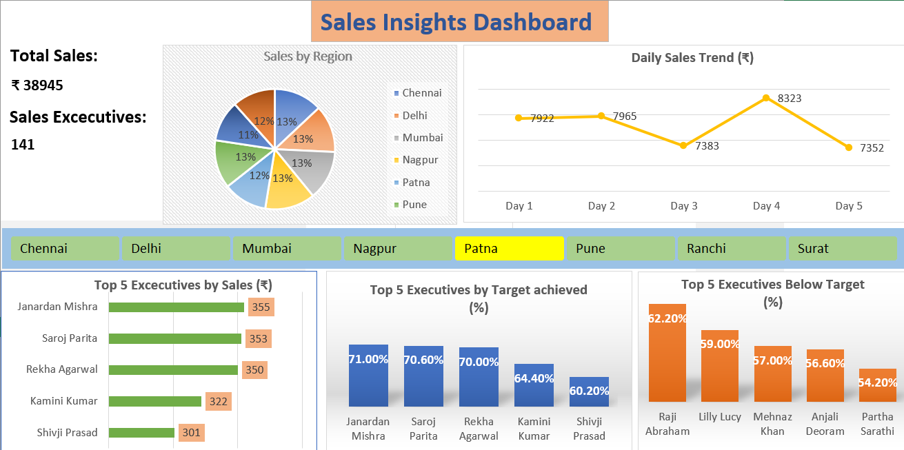

# Sales Insights Dashboard (Excel)

## Overview
This project is an Excel-based Sales Insights Dashboard designed to analyze
overall sales performance, regional contribution, daily sales trends,
and executive-level target achievement.

## Dashboard Preview

## Key Features
- KPI cards for Total Sales and Sales Executives
- Region-wise sales analysis 
- Daily sales trend visualization (₹)
- Top 5 executives by sales (₹)
- Top 5 executives by target achieved (%)
- Top 5 executives below target (%)

## Tools Used
- Microsoft Excel
- Pivot Tables & Pivot Charts
- Slicers
- Excel formulas for KPIs

## Business Insights
- Identifies high and low performing sales executives
- Highlights regional contribution to total sales
- Helps management focus on underperforming areas

## Author
Aditya Patayane